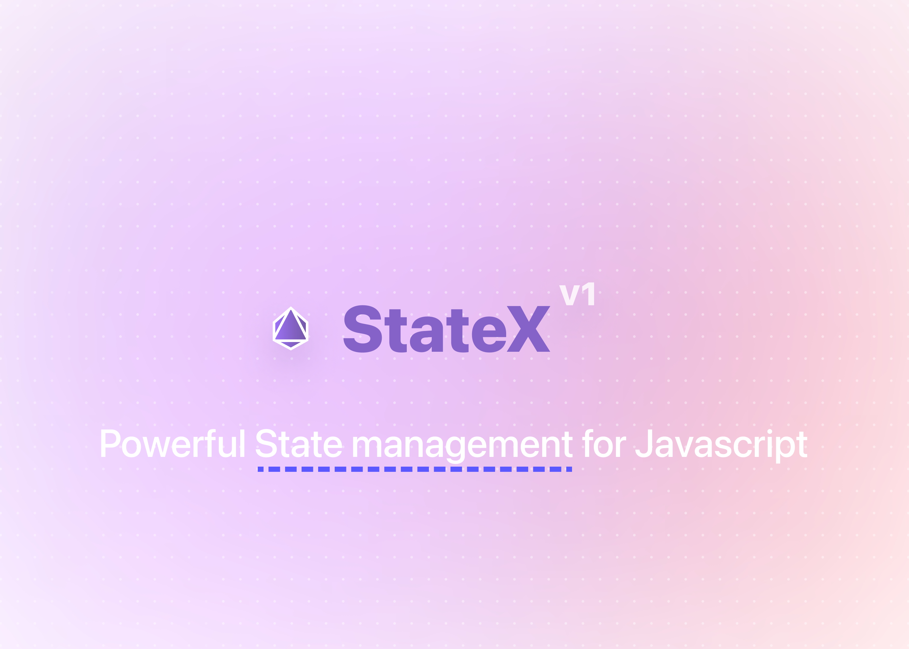

<!--  -->

 

**StateX** is a blazing fast and lightweight library for managing state in a Javascript app.

## Features

- 💨 **Fast** − Our APIs just run lightning fast, no more slowdowns.
- 😵 **Light (5kb)** - Too much lightweight, no more large bundle sizes
- 🤓 **Extensible** - Extend the `State` class to create your own custom state object.
- 🫥 **Asynchronous** - If you are fed-up with how messy it is to save state inside a asynchronous operation, say goodbye to it.
